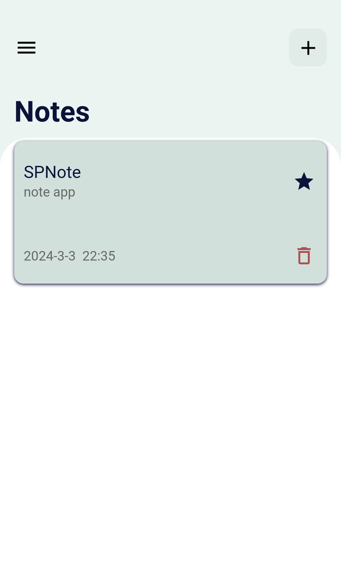
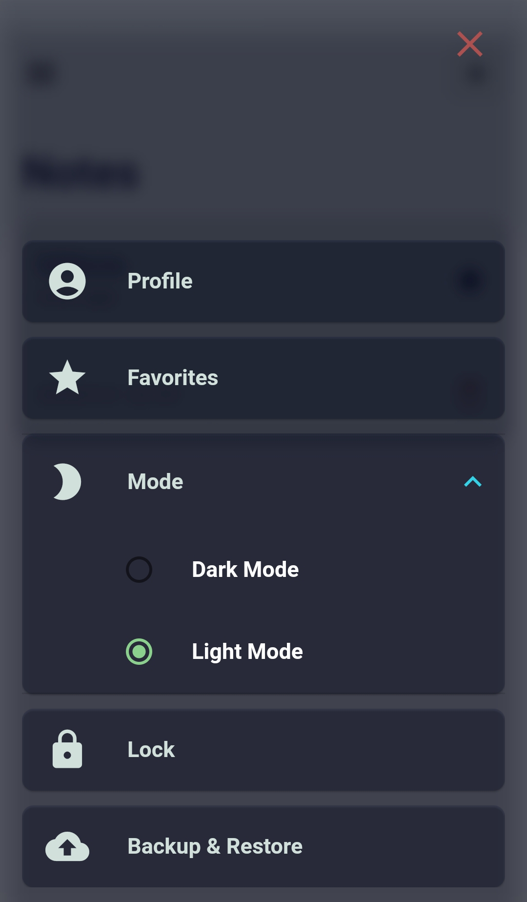

# SPNotes

Secure Privet Notes is a robust Flutter application designed to keep your notes safe and easily accessible.
 With Secure Notes, you can manage your notes with ease, ensuring your sensitive information remains private and secure.

 
## Screenshots

## Features

- **Note Management**: Add, edit, and delete notes effortlessly.
- **Favorites**: Mark important notes as favorites for quick access.
- **Passcode Lock**: Protect your notes with a passcode, keeping them safe from prying eyes.
- **Cloud Backup**: Seamlessly backup and restore your notes to and from Firebase, allowing you to access your notes from anywhere at any time.

## Technologies Used

SPNotes is built using the following technologies:

- **Flutter**: A framework for building cross-platform mobile applications.
- **Dart**:A programming language used for building Flutter apps.
- **Firebase Auth and Firestore**: Used for user authentication and cloud storage of notes.
- **Cubit**: Employed as a state management solution following the MVC pattern.
- **local_auth**: Integrated for enabling fingerprint authentication to skip passcode entry.
- **shared_preferences**: Utilized for local storage of app settings.
- **Hive**: Employed as a local NoSQL database for storing notes locally.

## Installation

Before installing SPNotes, make sure you have the following prerequisites installed:

- Flutter: See Flutter's installation guide for instructions on how to install Flutter.

Once you have the prerequisites installed, follow these steps to install Gallery:

1. Clone this repository to your local machine.
2. Navigate to the root directory of the project.
3. Run `flutter pub get` to install the required dependencies.
4. Run `flutter run` to launch the app.
